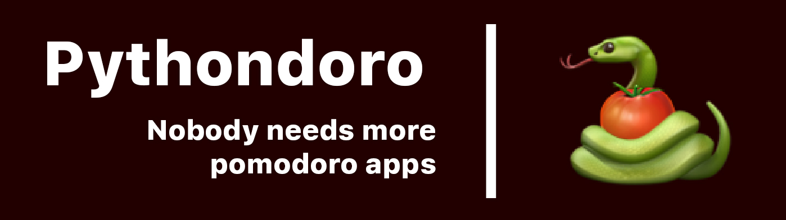

# 🐍🍅 Pythondoro - Another pomodoro app


Simple, minimal, small timer with always on top function  
Lovely made ❤ with [PySimpleGUI](https://github.com/PySimpleGUI/PySimpleGUI/)

## 🔧 Installation  

Open your terminal, navigate to **Pythondoro** folder and run this command

```bash
pip install -r requirements.txt
```

## 🎨 Usage

- Start `main.pyw`
- Right click on the window to access the `settings`
    - `Pomodoro lenght`: time of productivity (in minutes)
    - `Pause lenght`: time of productivity (in minutes)
    - `Auto start pomodoro`: Auto start pomodoro after pause
    - `Auto start pause`: Auto start pause after pomodoro

- Access the headless, always on top, window clicking `On top` button
    - Grab it anywhere and move it around
    - Right click and `Enlarge` to go back to the normal window


## 📝 Very important note  

Always on top function works only if you don't enter fullscreen apps.  
Notably, videogames enter fullscreen. Consider changing the video settings of your game from fullscreen to boarderless window/boarderless fullscreen.  
If not available, run this [Boarderless-Gaming](https://github.com/Codeusa/Borderless-Gaming/releases) and change your game settings to windowed, adjusting the resolution to match your screen

## 🔍 Known bugs 

- Right-clicking on window (not on top) pauses the timer until right-click menu is not closed  
    - This is more or less a problem of PySimpleGUI that I've yet to discover how to solve
- Setting window pauses the timer until closed  
    - I would have to change to many things. I just designed it while coding it with no modularity in mind so it is what it is `¯\_(ツ)_/¯`

## 🐛 Prone to bugs  
This code has been written only to remove the idea from my head
It could be better (a lot) but for the things it should do it's fine
Hit the issue tab to report a bug

